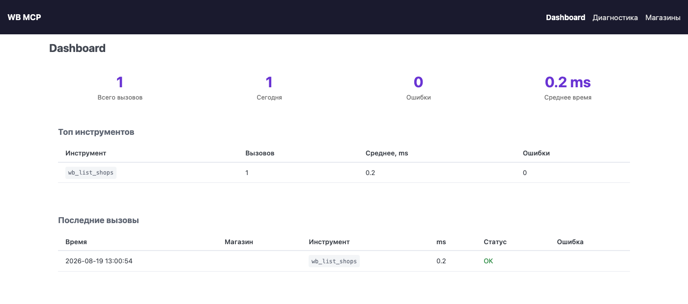

[English](README.en.md) · [中文](README.zh.md)

# WB MCP Server

[](LICENSE)
[](pyproject.toml)
[](docs/tools.md)
[](#как-это-устроено)

**Управляйте магазинами Wildberries из чата с ИИ-ассистентом.**
202 инструмента Seller API — карточки, цены, реклама, поставки, отзывы, финансы, аналитика —
доступны Claude, Cursor, Copilot, Gemini CLI и любому другому MCP-клиенту.
Для продавцов WB, у которых один или несколько кабинетов и нет желания кликать в личном
кабинете то, что можно спросить словами.

Сервер в ежедневной работе больше пяти месяцев, на порядка двадцати кабинетах WB,
202 инструмента. Это личный рабочий инструмент автора, и обновляется он по мере
собственной необходимости — [как именно](#обновления-и-поддержка).

```
Ты: Какие мои карточки заблокированы и почему?
Ты: Покажи ДРР по всем кампаниям за неделю и выключи те, где он выше 15%.
Ты: На каких складах коэффициент приёмки сейчас 0 или 1?
Ты: Ответь на все новые отзывы с оценкой 5 благодарностью.
```



---

## Что умеет

202 инструмента, сгруппированные по разделам Wildberries Seller API.
Полный нумерованный список с описанием каждого — в **[docs/tools.md](docs/tools.md)**.

| Раздел | Кол-во | Что закрывает |
|---|---:|---|
| Карточки товаров | 26 | список и детали карточек, создание и обновление, SEO, характеристики, баркоды, медиа, теги, корзина, **карточки с ошибками и блокировками** |
| Цены и скидки | 7 | текущие цены, установка цен и скидок, карантин, WB Клуб, B2B, статус загрузки |
| Акции и автоакции | 7 | календарь промо, автоакции, аудит «куда WB уже добавил товары», вход и выход из акции |
| Реклама | 22 | список и создание кампаний, статистика и ДРР, ставки и рекомендации, кластеры и минус-фразы, баланс и пополнение |
| Аналитика | 25 | воронка продаж v3, история по дням, остатки, антифрод, платная приёмка, штрафы за замеры, доля бренда, продажи по регионам, поисковые запросы |
| Статистика | 3 | продажи, заказы, остатки (statistics-api) |
| Заказы FBS | 29 | новые и все сборочные задания, статусы, отмена, стикеры, поставки, короба, пропуска, маркировка КИЗ |
| Заказы DBS | 10 | доставка силами продавца: заказы, статусы, действия, даты доставки, метаданные |
| Самовывоз (click & collect) | 9 | заказы самовывоза, подтверждение личности покупателя, действия и метаданные |
| Поставки FBW | 6 | поставки на склады WB, товары в поставке, склады, **коэффициенты приёмки на 14 дней** |
| Склады и остатки | 8 | склады продавца, обновление и получение остатков |
| Финансы | 7 | отчёты о реализации, детализация, эквайринг, баланс, данные продавца |
| Тарифы и хранение | 6 | короба, паллеты, возвраты, комиссии, транзит FBW, платное хранение |
| Отзывы и вопросы | 18 | отзывы и вопросы, ответы, счётчики за период, архив, закреплённые отзывы, рейтинг продавца |
| Возвраты | 3 | заявки на возврат, ответ на заявку, отчёт по возвратам |
| Чаты с покупателями | 4 | чаты, события, отправка сообщений, скачивание вложений |
| Документы | 4 | категории документов, список, скачивание по одному и пакетом |
| Пользователи | 2 | сотрудники и приглашения |
| WB Джем | 1 | статус подписки на Джем |
| Магазины | 1 | список подключённых магазинов |
| Диагностика | 4 | самодиагностика, разбор токена, деградации инструментов, новости API WB |

Три вещи, которых обычно нет у похожих серверов:

- **Мульти-магазин.** Каждый вызов принимает `shop_id`, поэтому два кабинета WB живут
  в одном диалоге. Если магазин один — `shop_id` можно не указывать.
- **Диагностика WB API.** Сервер сам пингует хосты WB, делает лёгкие пробные запросы
  по каждой категории, разбирает срок действия и права токена и подсвечивает
  «деградации»: инструмент раньше работал, а теперь стабильно падает — верный признак,
  что WB изменил API.
- **Шифрование токенов.** Токены WB лежат зашифрованными (Fernet), а не в конфиге клиента.

## Быстрый старт

Нужен Docker (Docker Desktop или OrbStack) и токен Wildberries Seller API.

> **Перед первым запуском.** Сейчас сборка «с нуля» подтягивает библиотеку `mcp` 2.x,
> с которой сервер не стартует. Обходной путь и подробности —
> в разделе [«Как это устроено»](#как-это-устроено), пункт про версию `mcp`.

```bash
git clone https://github.com/DeviceIngineering/wb-mcp-server.git
cd wb-mcp-server
cp .env.example .env          # для локального запуска можно оставить как есть
docker compose up -d --build
```

Проверка:

```bash
curl -s http://localhost:8001/api/health
# {"status":"ok","auth_enabled":false,"health_check_interval_min":30,...}
```

Что открылось:

| Адрес | Что это |
|---|---|
| <http://localhost:8001> | дашборд: вызовы инструментов, ошибки, время ответа |
| <http://localhost:8001/shops> | магазины: добавить кабинет WB, проверить токен |
| <http://localhost:8001/diagnostics> | диагностика: токены, ping хостов WB, пробы, история |
| <http://localhost:8001/api/health> | JSON-сводка для внешнего мониторинга |
| `http://localhost:8001/sse` | **MCP-эндпоинт**, его вы даёте клиенту |

Дальше:

1. Откройте <http://localhost:8001/shops> → **Добавить магазин** → вставьте токен WB → **Проверить**.
   Токен берётся в портале продавца: **Настройки → Доступ к API → Создать токен**
   (срок жизни 180 дней, остаток виден на странице диагностики).
2. Подключите MCP-клиент — см. следующий раздел.
3. Спросите ассистента: «покажи список моих магазинов на Wildberries» — должен сработать
   инструмент `wb_list_shops`.

Разбор команды запуска:

| Флаг | Зачем |
|---|---|
| `up` | поднять сервис, описанный в `docker-compose.yml` |
| `-d` | в фоне, не занимая терминал |
| `--build` | собрать образ из `Dockerfile` — нужно при первом запуске и после обновления кода |

Остановить: `docker compose down` (данные останутся в томе `wb_data`).
Логи: `docker compose logs -f`.

<details>
<summary>Запуск без Docker</summary>

```bash
git clone https://github.com/DeviceIngineering/wb-mcp-server.git
cd wb-mcp-server
python3 -m venv .venv && source .venv/bin/activate
pip install .
DATA_DIR=./data PORT=8001 python -m wb_mcp.app
```

`DATA_DIR` указывать обязательно: по умолчанию сервер пишет в `/data` — путь внутри контейнера.
</details>

## Установка в клиенты

Сервер отдаёт MCP по **SSE**: `GET /sse` — поток событий, `POST /messages` — сообщения клиента.
Поддержка SSE у клиентов разная, поэтому под каждый есть отдельная инструкция —
с путями к конфигу на macOS, Linux и Windows, готовым JSON и вариантами с токеном и без.

| Клиент | SSE напрямую | Инструкция |
|---|---|---|
| Claude Code | да | [docs/claude-code.md](docs/claude-code.md) |
| Claude Desktop | нет → мост `mcp-remote` или локальный stdio | [docs/claude-desktop.md](docs/claude-desktop.md) |
| Cursor | да | [docs/cursor.md](docs/cursor.md) |
| Windsurf | да | [docs/windsurf.md](docs/windsurf.md) |
| VS Code (GitHub Copilot) | да | [docs/vscode-copilot.md](docs/vscode-copilot.md) |
| Cline | да | [docs/cline.md](docs/cline.md) |
| Continue.dev | да | [docs/continue.md](docs/continue.md) |
| Zed | по URL; поддержка SSE официально не заявлена | [docs/zed.md](docs/zed.md) |
| JetBrains AI Assistant | да (SSE как legacy) | [docs/jetbrains.md](docs/jetbrains.md) |
| Gemini CLI | да | [docs/gemini-cli.md](docs/gemini-cli.md) |
| Codex CLI | нет → мост `mcp-remote` | [docs/codex.md](docs/codex.md) |

Общий обзор и таблица совместимости — [docs/README.md](docs/README.md).

Самый короткий вариант, Claude Code:

```bash
claude mcp add --transport sse wildberries http://localhost:8001/sse
```

## Мульти-магазин и безопасность

**Несколько кабинетов.** Магазины добавляются на `/shops`, каждый получает свой `shop_id`.
Инструмент `wb_list_shops` возвращает список; 200 из 202 инструментов принимают `shop_id`
первым параметром (исключения — `wb_list_shops` и `wb_degradations`).
Если магазин один, параметр можно опустить: сервер подставит единственный доступный.

Смысл не в том, чтобы «уметь два аккаунта», а в том, что **стратегия пишется один раз
и раскатывается на все кабинеты**: правило по ценам, шаблон ответов на отзывы, потолок
ставки в рекламе применяются ко всем магазинам в одном диалоге — без переключения
аккаунтов и без раскладывания ключей по конфигам разных клиентов.
**Сколько кабинетов можно подключить.** Ограничения в коде нет: `shops.json` — обычный
словарь, добавляйте сколько угодно. Потолок задаёт не сервер, а **Wildberries**: все
кабинеты ходят в WB **с одного IP-адреса** — того, где стоит этот сервер, — а лимиты
считаются в том числе по адресу. Оценка автора: порядка двух десятков кабинетов на один
адрес держатся в безопасной зоне. Дальше — разносить по нескольким серверам с разными
адресами.

Почему это важнее, чем кажется, видно из [лимитов WB](#ограничения-wildberries-api):
у ряда методов **3 запроса в минуту**, а **любой ответ 4XX засчитывается как 10 запросов**.
При десятке кабинетов на одном сервере несколько неверных запросов подряд съедают лимит
в десять раз быстрее — и упрутся в него **все магазины сразу**, а не тот, где ошиблись.

Следить за этим есть чем:

- **Фоновая диагностика** шлёт по одному `/ping` на хост за прогон (лимит — 3 запроса
  за 30 секунд на хост) и складывает неудачные проверки и предупреждения в историю.
  Приближение к лимиту видно заранее, а не по факту блокировки.
- **Детектор деградаций** различает два случая: одновременная деградация многих
  инструментов — это троттлинг по адресу, деградация одного — сломался конкретный
  эндпоинт WB. По дашборду это видно с одного взгляда.

**Где лежат токены.** В томе `wb_data` (внутри контейнера — `/data`):

- `shops.json` — магазины, токены зашифрованы Fernet;
- `.encryption_key` — ключ шифрования, генерируется при первом запуске;
- `stats.db` — SQLite со статистикой вызовов и историей диагностики.

Ключ лежит рядом с зашифрованными данными, поэтому шифрование защищает от случайной
утечки одного файла `shops.json` (бэкап, копипаста), но не от того, кто получил доступ
ко всему тому. Переносить данные нужно томом целиком — см. [DEPLOY.md](DEPLOY.md).

**Авторизация MCP.** Переменная `MCP_AUTH_TOKEN` в `.env`:

```bash
openssl rand -hex 32   # значение вписать в .env → MCP_AUTH_TOKEN=
docker compose up -d
```

- пусто (по умолчанию) — `/sse` открыт всем, у кого есть сетевой доступ к порту;
- задан — клиент обязан передать `Authorization: Bearer <токен>` **или** `?token=<токен>`
  в URL. Второй вариант выручает клиенты, которые не умеют произвольные заголовки.

**Чего сервер не делает:**

- Веб-интерфейс (`/`, `/shops`, `/diagnostics`) и `POST /messages` токеном **не закрыты**:
  проверка выполняется только на `GET /sse`. Держите порт 8001 в доверенной сети.
- Порт 8001 не рассчитан на проброс в интернет. Для доступа извне — Tailscale или VPN.
- HTTPS сервер не терминирует. Нужен внешний доступ по TLS — ставьте reverse proxy.

## Веб-интерфейс: видно каждый вызов

У обычного MCP-сервера вызовы уходят в никуда: что именно ассистент сделал, сколько это
заняло и что ответил маркетплейс — не видно, а о проблеме узнаёшь, когда что-то
не сработало. Здесь на каждый вызов есть запись, а на каждый магазин — состояние.
Для инструмента, которым управляют реальными деньгами в магазине, это условие доверия,
а не украшение. За пять месяцев ежедневной работы на двух десятках кабинетов эти страницы
и накопили то, что перечислено в разделе про лимиты WB.

### Дашборд — `/`

Сводка по всем вызовам инструментов (`stats.get_summary()`):

- всего вызовов, вызовов за сегодня, число ошибок, средняя длительность вызова;
- **топ-10 инструментов**: сколько раз вызван, среднее время, сколько ошибок;
- **лента последних 50 вызовов**: время, магазин, инструмент, длительность в миллисекундах,
  успех или ошибка, текст ошибки;
- **фильтр по магазину** — переключатель «Все / конкретный кабинет» над сводкой.

### Магазины — `/shops`

Кабинеты добавляются и удаляются прямо в браузере, без правки файлов и перезапуска
контейнера. У каждого магазина есть кнопка **«Проверить»**: она делает лёгкий реальный
запрос к WB и сразу говорит, живой ли токен, — а не оставляет выяснять это в момент
первого рабочего вызова. В списке токены показываются замаскированными (`abc***xyz`).

Токены шифруются Fernet и лежат в `shops.json` внутри тома с данными; ключ —
в `.encryption_key` там же. Пул HTTP-клиентов сбрасывается при сохранении и удалении
магазина, так что новый токен подхватывается сразу.

### Диагностика — `/diagnostics`

Фоновая проверка каждые `HEALTH_CHECK_INTERVAL_MIN` минут (по умолчанию 30), по каждому
магазину:

- **токен** — срок действия, категории доступа, флаги «только чтение» и «песочница»;
- **ping 13 хостов WB API** — доступность и задержка каждого;
- **20 проб** — по одному лёгкому реальному GET на категорию API. Именно они ловят
  ситуацию «эндпоинт отдаёт 404, потому что WB его переименовал»;
- **предупреждения** человеческим языком: «токен истекает через N дней»,
  «Контент: 404 на /content/v2/... — возможно, WB изменил API»;
- **история проверок** с автоматической ротацией (хранятся последние 1000 записей);
- кнопка **«Проверить сейчас»** — прогнать всё немедленно.

### Детектор деградаций

Самое полезное, что даёт накопленная статистика. Сервер сам находит инструменты,
которые **раньше работали, а теперь стабильно падают**: последние три вызова — ошибки,
при этом успешные вызовы в истории были. По каждому такому инструменту показываются
время последнего успешного вызова, число подряд идущих ошибок, текст последней ошибки
и момент, когда всё сломалось.

То есть сервер по собственной статистике обнаруживает, что Wildberries сломал или
отключил эндпоинт, — и говорит об этом до того, как вы упрётесь в это в работе.
Рядом с [разделом про лимиты и сроки отключения эндпоинтов](#ограничения-wildberries-api)
это его практическое продолжение: там перечислено то, что WB уже анонсировал,
здесь — то, что он сделал молча.

Смотреть можно на дашборде или инструментом `wb_degradations` — прямо из чата.

### JSON для внешнего мониторинга

Всё, что видно глазами, снимается и машиной:

| Эндпоинт | Что отдаёт |
|---|---|
| `GET /api/health` | статус сервиса, включена ли авторизация, интервал проверок, последние 5 health-проверок, список деградировавших инструментов |
| `GET /api/stats` | та же сводка, что на дашборде; принимает `?shop=<shop_id>` |
| `POST /api/diagnostics/run` | прогнать диагностику всех магазинов сейчас, вернуть результат |
| `GET /api/diagnostics/<shop_id>` | полная живая диагностика одного магазина |

Так что сервер можно повесить в Uptime Kuma, Zabbix или любой другой мониторинг
и узнавать о сломанном токене раньше, чем о нём расскажет ассистент.

## Как это устроено

Один Docker-контейнер, внутри FastAPI-приложение, которое совмещает две роли:
MCP-сервер по SSE и небольшой веб-интерфейс. По файлу на абзац:

- **`wb_mcp/server.py`** — сам MCP-сервер. Список `TOOLS` из 202 объектов `Tool` (имя,
  описание, JSON-схема аргументов) — это то, что клиент получает в ответ на `tools/list`.
  Вызовы разводятся тремя словарями: `NO_CLIENT_DISPATCH` (доступ к WB не нужен),
  `CLIENT_DISPATCH` (нужен HTTP-клиент магазина), `SHOP_DISPATCH` (нужен ещё и `shop_id`).
  Тут же живёт stdio-точка входа `main()` — на случай клиента, который умеет только stdio.
- **`wb_mcp/client.py`** — HTTP-клиенты 14 хостов Wildberries. Один `WBClient` на магазин,
  внутри `httpx.AsyncClient` с токеном; клиенты кэшируются в пуле по `shop_id`.
- **`wb_mcp/app.py`** — FastAPI: `GET /sse` и `POST /messages` для MCP, страницы дашборда,
  магазинов и диагностики, JSON-API `/api/*`, проверка `MCP_AUTH_TOKEN`, фоновый цикл
  health-проверок.
- **`wb_mcp/settings.py`** — магазины и ключи: чтение и запись `shops.json`, шифрование
  Fernet, миграция старого однокабинетного `settings.json`, маскирование токенов для UI.
  Есть fallback: если задана переменная `WB_API_TOKEN`, появляется магазин `default`.
- **`wb_mcp/diagnostics.py`** — ping хостов WB, декодер JWT-токена (срок, права, sandbox),
  «пробы» — по одному лёгкому реальному запросу на категорию API, новости WB.
- **`wb_mcp/stats.py`** — SQLite через aiosqlite: каждый вызов инструмента пишется с временем,
  успехом и `shop_id`; отсюда берутся детектор деградаций и история health-проверок.
- **`wb_mcp/templates/`** — три страницы на PicoCSS, без сборки фронтенда.

Неочевидные места:

- **`shop_id` подставляется сам, пока магазин один.** Удобно в быту, но при добавлении
  второго кабинета запросы без `shop_id` начнут возвращать «Укажите shop_id».
- **В статистику пишется каждый вызов**, включая упавшие. Отсюда работает детектор
  деградаций: «раньше работало, теперь стабильно падает» — сигнал изменения WB API,
  а не вашей ошибки. Смотреть: инструмент `wb_degradations` или дашборд.
- **Фоновая диагностика раз в 30 минут** делает реальные запросы к WB и расходует лимиты.
  Мешает — поставьте `HEALTH_CHECK_INTERVAL_MIN=0` в `.env`.
- **Ответы возвращаются как есть**, сырым JSON от WB, без переупаковки. Инструменты от этого
  предсказуемы, но крупные отчёты стоит запрашивать с фильтрами, иначе ответ съест контекст.
- **В логах контейнера на каждое MCP-сообщение появляется** `RuntimeError: Unexpected ASGI
  message 'http.response.start' sent, after response already completed`. Это следствие того,
  что `POST /messages` обёрнут в маршрут FastAPI, а не смонтирован как ASGI-приложение.
  Сообщение к этому моменту уже принято (`202 Accepted`) и обработано — на проверке
  официальным MCP-клиентом Python (`mcp` 1.29.0) `initialize`, `tools/list` и вызов
  инструмента отработали штатно. Но соединение на каждом POST рвётся, поэтому
  клиенты, которые переиспользуют keep-alive, могут споткнуться. Ошибка в логе —
  ожидаемая, а не признак поломки.
- **Версия библиотеки `mcp` — известная проблема.** Сервер написан под декораторное API
  `mcp` 1.x (`@app.list_tools()`); в `mcp` 2.0 его убрали. В `pyproject.toml` указано
  `mcp[cli]>=1.0.0` без верхней границы, поэтому свежая установка тянет `mcp` 2.x
  и падает на старте с `AttributeError: 'Server' object has no attribute 'list_tools'`.
  До того, как ограничение появится в `pyproject.toml`, обходной путь — поставить
  библиотеку 1.x явно:

  ```bash
  pip install "mcp[cli]<2.0.0"          # локальный запуск
  ```

  Для Docker — добавить ту же строку в `Dockerfile` после `pip install .`
  либо дождаться исправления в репозитории.

Переменные окружения:

| Переменная | По умолчанию | Значение |
|---|---|---|
| `WB_API_TOKEN` | пусто | токен для магазина `default`; удобнее добавлять магазины через `/shops` |
| `MCP_AUTH_TOKEN` | пусто | Bearer-токен для `/sse`; пусто — авторизация выключена |
| `HEALTH_CHECK_INTERVAL_MIN` | `30` | период фоновой диагностики, `0` — выключить |
| `DATA_DIR` | `/data` | каталог с `shops.json`, `.encryption_key`, `stats.db` |
| `PORT` | `8001` | порт HTTP-сервера |

## Ограничения Wildberries API

Это ограничения самого WB, а не сервера, — но ассистент будет натыкаться на них регулярно,
и знать о них лучше заранее. Список собран не переписыванием справки: это пять месяцев
ежедневных вызовов на двух десятках кабинетов плюс журнал диагностики.

- `GET /adv/v3/fullstats` (статистика рекламы) — **3 запроса в минуту**, период не больше 31 дня.
- Воронка продаж v3 — **3 запроса в минуту**; история по дням доступна максимум
  за последнюю неделю.
- `/ping` — 3 запроса за 30 секунд на хост (фоновая диагностика это учитывает).
- **Любой ответ 4XX засчитывается WB как 10 запросов** к лимиту (правило с 04.06.2026).
  Один неверный параметр в цикле — и вы упёрлись в лимит.
- `reportDetailByPeriod` удаляется 15.07.2026; сервер уже ходит в finance-api
  с fallback на старый эндпоинт.
- Создание поставок FBW через API невозможно — только в личном кабинете.
  Инструменты `wb_fbw_*` информационные.
- Токен WB живёт 180 дней. Остаток показывают `wb_token_info` и страница `/diagnostics`.
- Ответ `429` от WB — это лимит, а не поломка. Повторите через минуту.

Сверено с документацией dev.wildberries.ru по состоянию на июнь 2026.

## Технический справочник

### Хосты Wildberries Seller API

| API | Базовый URL |
|-----|-------------|
| Content | content-api.wildberries.ru |
| Marketplace (FBS/DBS/DBW) | marketplace-api.wildberries.ru |
| Supplies (FBW) | supplies-api.wildberries.ru |
| Statistics | statistics-api.wildberries.ru |
| Analytics | seller-analytics-api.wildberries.ru |
| Prices | discounts-prices-api.wildberries.ru |
| Promotions calendar | dp-calendar-api.wildberries.ru |
| Advert | advert-api.wildberries.ru |
| Finance | finance-api.wildberries.ru |
| Feedbacks + Questions | feedbacks-api.wildberries.ru |
| Returns | returns-api.wildberries.ru |
| Tariffs / News / Seller | common-api.wildberries.ru |
| Buyer Chat | buyer-chat-api.wildberries.ru |
| Documents | documents-api.wildberries.ru |

### Диагностика

- **Страница `/diagnostics`** — по каждому магазину: срок действия токена и его права,
  ping всех хостов WB API, пробы по категориям, история проверок, кнопка «Проверить сейчас».
- **Фоновая автопроверка** каждые `HEALTH_CHECK_INTERVAL_MIN` минут.
- **Детектор деградаций** — подсвечивает на дашборде инструменты, которые перестали работать.
- **MCP-инструменты**: `wb_diagnostics`, `wb_token_info`, `wb_degradations`, `wb_api_news`.
- **`GET /api/health`** — JSON-сводка для мониторинга извне.
- **`POST /api/diagnostics/run`** — прогнать проверку всех магазинов прямо сейчас.
- **`GET /api/diagnostics/<shop_id>`** — полная диагностика одного магазина.

### Структура проекта

```
wb-mcp-server/
├── docker-compose.yml          # порт 8001, том wb_data
├── Dockerfile                  # python:3.12-slim
├── pyproject.toml
├── DEPLOY.md                   # деплой на отдельную машину, перенос данных
├── docs/                       # подключение клиентов + справочник инструментов
└── wb_mcp/
    ├── server.py       # MCP-сервер: 202 инструмента, диспетчеризация, stdio-режим
    ├── client.py       # HTTP-клиенты 14 API Wildberries
    ├── app.py          # FastAPI: SSE + веб-интерфейс + авторизация + health-loop
    ├── diagnostics.py  # ping, JWT-декодер, пробы, новости API
    ├── settings.py     # магазины и ключи (Fernet)
    ├── stats.py        # статистика вызовов и история проверок (SQLite)
    └── templates/      # PicoCSS: dashboard, diagnostics, shops
```

### Деплой

Вынести сервер на отдельную машину, перенести магазины, настроить автозапуск —
см. **[DEPLOY.md](DEPLOY.md)**.

## Обновления и поддержка

Wildberries меняет API постоянно: эндпоинты добавляются, переименовываются и отключаются —
в разделе про ограничения перечислено то, что уже поймано на практике.
Этот сервер — рабочий инструмент автора: больше пяти месяцев ежедневной работы
на порядка двадцати кабинетах. Обновляется он **по мере собственной необходимости**:
когда очередное изменение ломает что-то в его магазинах, а не по расписанию.
Поэтому промежутки между коммитами бывают долгими — это значит, что WB за это время
ничего не сломал. Обязательств по срокам нет.

Если исправление нужно срочно — напишите на **d0371153@gmail.com**.
Issues и pull request'ы тоже приветствуются и разбираются.

## Лицензия

MIT — см. [LICENSE](LICENSE).
